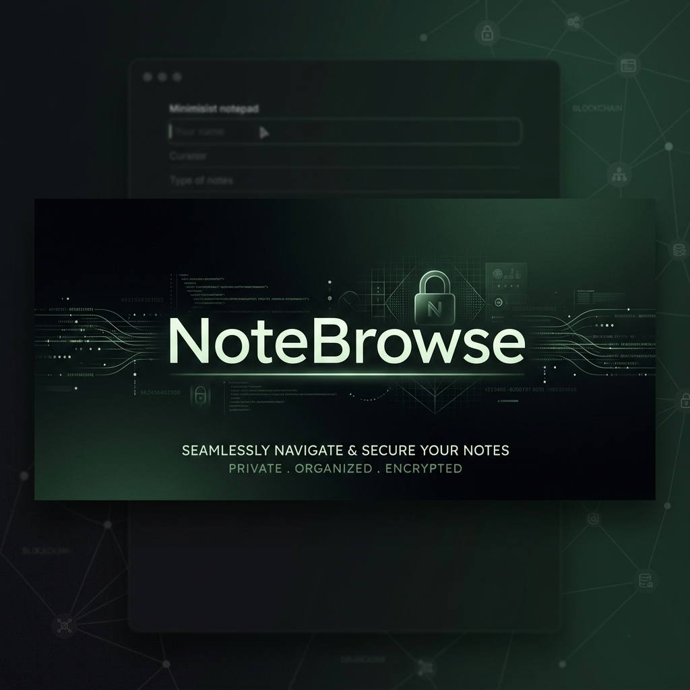
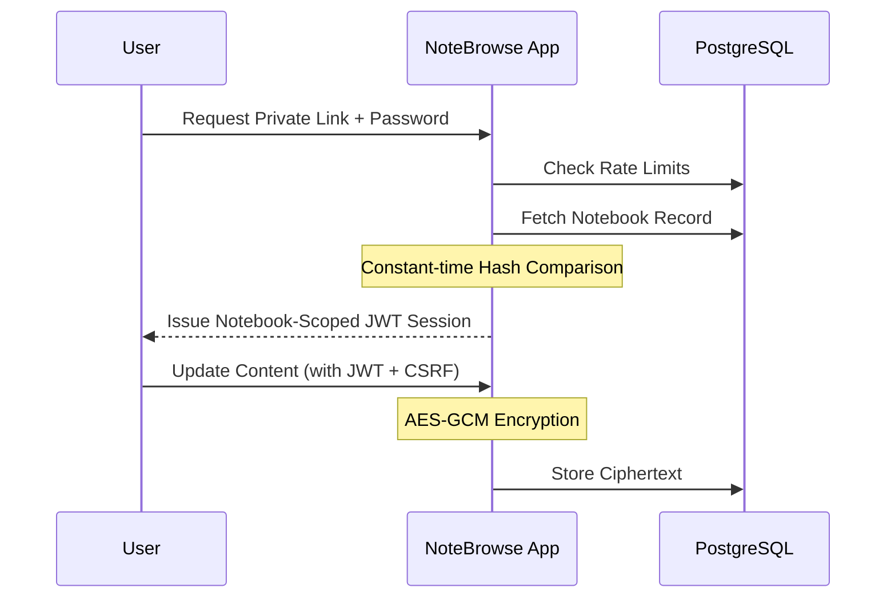

<div align="center">



# NoteBrowse

**The Security-First, Zero-Account Private Notepad**

[](https://nextjs.org/)
[](https://www.typescriptlang.org/)
[](https://www.postgresql.org/)
[](https://www.docker.com/)

---

NoteBrowse is a security-first web notepad where privacy is the default. There are no user accounts, no tracking, and no central identity management. Access is controlled entirely at the notebook level via a **Private Link + Notebook Password** gate.

[Features](#-features) • [Security Architecture](#-security-architecture) • [Deployment](#-quick-start-docker) • [Local Development](#-local-development)

</div>

## ✨ Features

- **🔐 Link-Based Privacy**: Create notes with custom or randomized secure slugs.
- **🛡️ Hardened Security**:
  - AES-GCM content encryption at rest.
  - Constant-time token comparisons to mitigate timing attacks.
  - Uniform 401 responses to prevent account/slug enumeration.
- **⏲️ Volatile Sessions**: Notebook-scoped sessions that expire after 15 minutes of inactivity.
- **🚫 Brute-Force Shield**: Multi-layered rate limiting (per-IP, per-slug) with automatic lockout mechanisms.
- **📜 Lifecycle Auditing**: Persistent audit logs for notebook creation, access, and deletion.
- **🐳 Docker Native**: Built from the ground up to be easily self-hosted in seconds.

---

## 🏗️ Security Architecture

NoteBrowse utilizes a stateless-first security model where the "account" is the notebook itself.



### Cryptographic Stack
- **Encryption**: AES-256-GCM for content encryption.
- **Hashing**: Argon2/PBKDF2 for password verification (configurable).
- **Session**: Secure, HttpOnly, SameSite=Strict cookies with notebook isolation.

---

## 🚀 Quick Start (Docker)

Deploy NoteBrowse to your server in 30 seconds using Docker Compose.

### 1. Prerequisites
- Docker & Docker Compose installed.

### 2. Deploy
```bash
# Clone the repository
git clone <your-repo-url>
cd NoteBrowse

# Start the stack
docker compose up -d --build

# Sync the database schema
docker compose exec app npx prisma db push
```

The app will be live at `http://localhost:3000`.

---

## 🛠️ Local Development

### Prerequisites
- Node.js v22+
- PostgreSQL instance

### Setup
1. **Install Dependencies**: `npm install`
2. **Environment**: Create a `.env` file with `DATABASE_URL`.
3. **Database Sync**: `npx prisma db push`
4. **Dev Server**: `npm run dev`

### Testing
Run the comprehensive Vitest suite:
```bash
npm run test
```

---

## 🗺️ Project Map

- `src/lib/notebooks/`: Core domain logic, crypto, and session management.
- `src/app/api/notebooks/`: RESTful backend endpoints.
- `src/components/`: Modular React components (UI/UX).
- `tests/`: High-coverage security and integration tests.

---

<div align="center">
Built with ❤️ for Privacy and Sovereignty.
</div>
